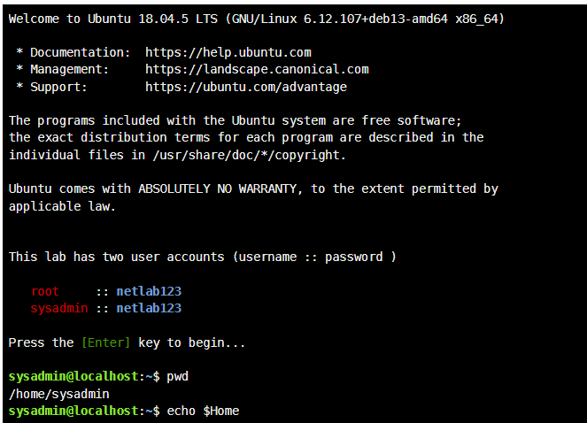
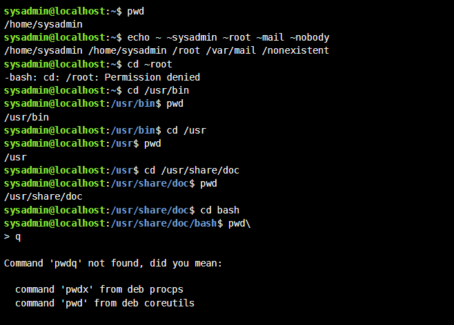
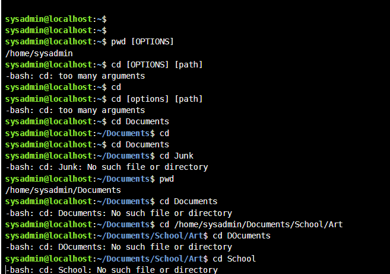
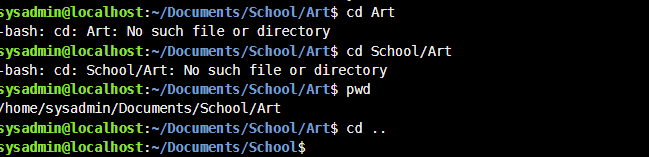
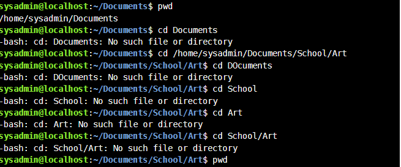
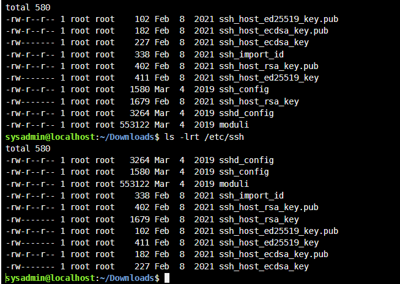
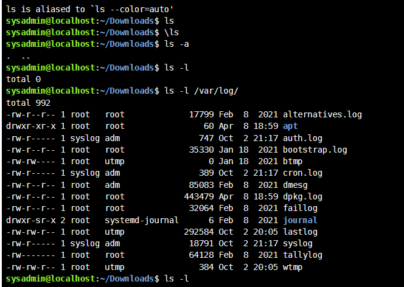
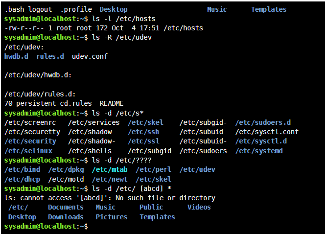

# NetAcad Linux: Module 7, Navigating the Filesystem

Hands-on lab documentation for **Module 7 (Navigating the Filesystem)** of the Cisco NetAcad Linux course, completed on the NetAcad Ubuntu 18.04 lab VM.

**Author:** Emmanuella Odetsi Martey ([@Ella-123-art](https://github.com/Ella-123-art))

## What this repository covers

- Finding my location with `pwd`
- Moving around with `cd` using absolute paths, relative paths, `..` and `~`
- Listing files with `ls` and its options (`-a`, `-l`, `-lrt`, `-R`, `-d`)
- Tilde expansion for different users
- Aliases and bypassing them with `\`
- File globbing with `*`, `?` and `[ ]`
- Common errors and what caused them

## Repository structure

```
netacad-linux-module-7/
├── README.md
├── .gitignore
├── docs/
│   └── module-7-navigating-the-filesystem.md   # full write-up with screenshots
├── scripts/
│   └── module7-commands.sh                     # read-only replay of lab commands
└── screenshots/                                # 8 terminal screenshots from the lab
```

## Quick start

```bash
git clone https://github.com/Ella-123-art/netacad-linux-module-7.git
cd netacad-linux-module-7
bash scripts/module7-commands.sh
```

The script only reads from the filesystem; it does not create, change or delete anything.

## Full write-up

See [`docs/module-7-navigating-the-filesystem.md`](docs/module-7-navigating-the-filesystem.md) for the walkthrough, command tables and lessons learned.

## Lab screenshots

### 1. Lab start and the `$HOME` variable


### 2. Tilde expansion and absolute paths


### 3. `cd` errors and too many arguments


### 4. Relative vs absolute paths


### 5. Case sensitivity


### 6. Listing files with `ls -lrt`


### 7. Aliases and `/var/log`


### 8. File globbing


## Key lessons

- Linux paths and variable names are **case-sensitive** (`$HOME`, not `$Home`).
- Relative paths depend on the current directory; confirm with `pwd` first.
- Square brackets in command syntax mean *optional* and are not typed.
- Spaces split arguments, so `/etc/[abcd]*` and `/etc/ [abcd] *` behave very differently.
- Normal users cannot enter `/root`; `Permission denied` is expected.

## Tools

NetAcad Ubuntu 18.04 lab VM, Bash, VS Code, Git and GitHub.
